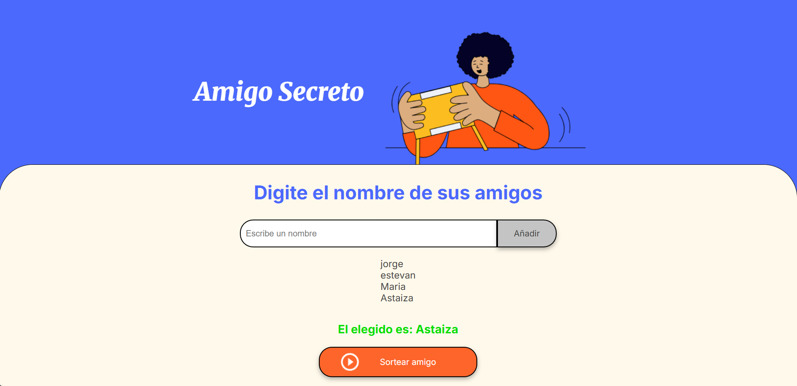
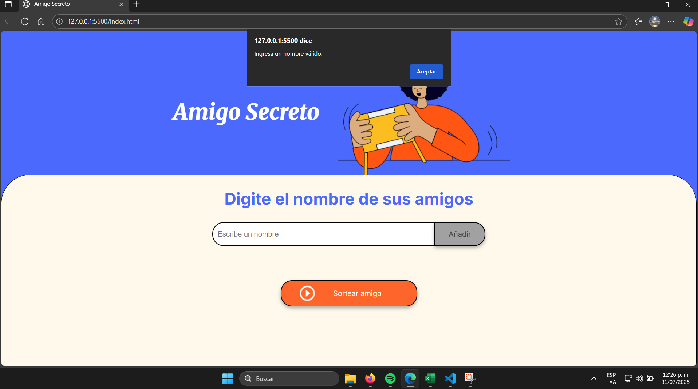

<h1>Challenge: Amigo Secreto | Oracle One</h1>

En el presente reto se le da al participante una carpeta comprimida con 4 archivos:
- Assets: Aquí se agregan las fotos usadas en el frontend.
- App: Aquí es donde se desarrolla la lógica de programación.
- index: Código HTMl que implementa botones.
- Style: Código CSS.

Además se indican las siguientes regla de juego:
El usuario tiene que tener la posibilidad de 
1. ingresar los nombres que desee y que al dar clic al boton "añadir" se reflejen en lista uno a uno en la pantalla.
2. Por otro lado, si por equivocación intenta añadir un texto vacío, debe saltar una alerta diciendo que escriba un nombre.
3. por último se pide que, una vez, teniendo los nombres añadidos, y al dar clic sobre el botón "sortear", se muestre un nombre aleatorio en pantalla.
   
A continuación se explica la lógica detrás de cada línea:

# Documentación del Código de la Aplicación de Amigo Secreto

## Variables Principales

<ul>
  <li><strong>listaAmigos</strong>: Arreglo donde se almacenan todas las personas añadidas después de dar clic en el botón "Añadir". 
    <pre><code class="language-javascript">const listaAmigos = [];</code></pre>
  </li>
  <li><strong>inputAmigo</strong>: Variable que guarda la referencia al elemento de entrada de texto con el <code>id="amigo"</code>. Permite acceder a su valor o modificar sus propiedades. 
    <pre><code class="language-javascript">const inputAmigo = document.getElementById("amigo");</code></pre>
  </li>
  <li><strong>ulListaAmigos</strong>: Variable que guarda la referencia al elemento <code>&lt;ul&gt;</code> con <code>id="listaAmigos"</code>, donde se muestra la lista de nombres añadidos. 
    <pre><code class="language-javascript">const ulListaAmigos = document.getElementById("listaAmigos");</code></pre>
  </li>
  <li><strong>ulResultado</strong>: Variable que guarda la referencia al elemento <code>&lt;ul&gt;</code> con <code>id="resultado"</code>, donde se muestra el nombre de la persona seleccionada aleatoriamente. 
    <pre><code class="language-javascript">const ulResultado = document.getElementById("resultado");</code></pre>
  </li>
</ul>

## Funciones

### <code>agregarAmigo()</code>
Esta función se ejecuta al hacer clic en el botón "Añadir" y realiza las siguientes acciones:

<ol>
  <li><strong>Validación de entrada</strong>: Verifica si el campo de texto está vacío. En JavaScript, un valor vacío (<code>""</code>) se evalúa como <code>false</code>. Si el campo está vacío, muestra una alerta. 
    <pre><code class="language-javascript">if (!inputAmigo.value) {
        alert("Ingresa un nombre válido.");
    }</code></pre>
  </li>
  <li><strong>Añadir nombre al arreglo</strong>: Si el campo no está vacío, el nombre ingresado se agrega al final del arreglo <code>listaAmigos</code>. 
    <pre><code class="language-javascript">listaAmigos.push(inputAmigo.value);</code></pre>
  </li>
  <li><strong>Actualizar la lista en el HTML</strong>: Agrega un nuevo elemento <code>&lt;li&gt;</code> con el nombre ingresado al elemento <code>&lt;ul&gt;</code> referenciado por <code>ulListaAmigos</code>. El operador <code>+=</code> permite añadir el nuevo elemento sin sobrescribir los anteriores. 
    <pre><code class="language-javascript">ulListaAmigos.innerHTML += `&lt;li&gt;${inputAmigo.value}&lt;/li&gt;`;</code></pre>
  </li>
  <li><strong>Limpiar el campo de texto</strong>: Resetea el valor del campo de texto para permitir ingresar un nuevo nombre. 
    <pre><code class="language-javascript">inputAmigo.value = "";</code></pre>
  </li>
</ol>

### <code>sortearAmigo()</code>
Esta función se ejecuta al hacer clic en el botón de sorteo y selecciona un amigo al azar:

<ol>
  <li><strong>Generar índice aleatorio</strong>: Crea un número aleatorio entre 0 y la longitud del arreglo <code>listaAmigos</code> (exclusivo) utilizando <code>Math.random()</code> y <code>Math.floor()</code>. 
    <pre><code class="language-javascript">const numeroAleatorio = Math.floor(Math.random() * listaAmigos.length);</code></pre>
  </li>
  <li><strong>Seleccionar amigo</strong>: Utiliza el índice aleatorio para obtener un nombre del arreglo <code>listaAmigos</code>. 
    <pre><code class="language-javascript">const amigoSecreto = listaAmigos[numeroAleatorio];</code></pre>
  </li>
  <li><strong>Mostrar resultado</strong>: Actualiza el elemento <code>&lt;ul&gt;</code> referenciado por <code>ulResultado</code> para mostrar el nombre del amigo secreto seleccionado. 
    <pre><code class="language-javascript">ulResultado.innerHTML = `&lt;li&gt;El elegido es: ${amigoSecreto}&lt;/li&gt;`;</code></pre>
  </li>
</ol>

## Notas Adicionales
<ul>
  <li>Los nombres de las funciones <code>agregarAmigo()</code> y <code>sortearAmigo()</code> están vinculados a los eventos <code>onclick</code> definidos en el código HTML, lo que permite que se ejecuten al hacer clic en los botones correspondientes en la interfaz.</li>
</ul>

